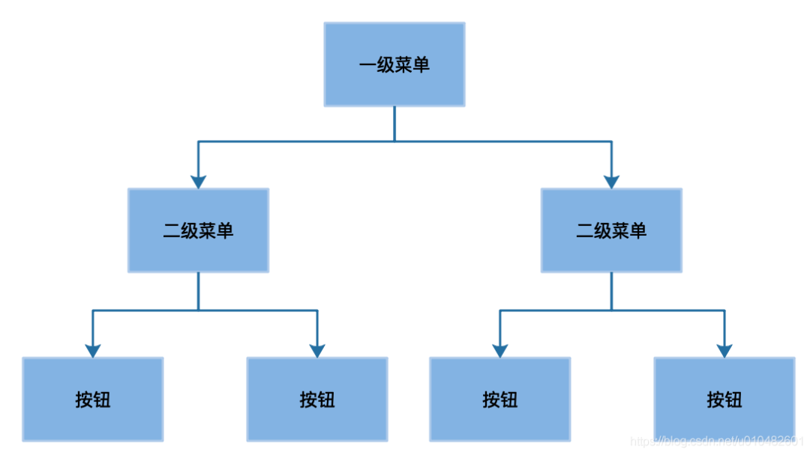

# 大数据分析常用去重算法分析『Bitmap 篇』

去重分析在企业日常分析中的使用频率非常高，如何在大数据场景下快速地进行去重分析一直是一大难点。在近期的 Apache Kylin Meetup 北京站上，我们邀请到 Kyligence 大数据研发工程师陶加涛为大家揭开了大数据分析常用去重算法的神秘面纱。

Apache Kylin 作为目前唯一一个同时支持精确与非精确去重查询的 OLAP 引擎，非常好地覆盖了大数据上的去重需求。本次分享讲解了 Kylin 这两种去重方式背后用到的算法，希望能让大家从源头上理解为什么 Kylin 的去重查询有着如此优异的性能。此次分享的回顾将分为两期，本篇首先为大家介绍精确去重算法 Bitmap 。

首先，请大家思考一个问题：在大数据处理领域中，什么环节是你最不希望见到的？以我的观点来看，shuffle 是我最不愿意见到的环节，因为一旦出现了非常多的 shuffle，就会占用大量的磁盘和网络 IO，从而导致任务进行得非常缓慢。而今天我们所讨论的去重分析，就是一个会产生非常多 shuffle 的场景，先来看以下场景：

<figure><figcaption></figcaption></figure>

我们有一张商品访问表，表上有 item 和 user\_id 两个列，我们希望求商品的 UV，这是去重非常典型的一个场景。我们的数据是存储在分布式平台上的，分别在数据节点 1 和 2 上。

我们从物理执行层面上想一下这句 SQL 背后会发生什么故事：首先分布式计算框架启动任务, 从两个节点上去拿数据, 因为 SQL group by 了 item 列, 所以需要以 item 为 key 对两个表中的原始数据进行一次 shuffle。我们来看看需要 shuffle 哪些数据：因为 select/group by了 item，所以 item 需要 shuffle 。但是，user\_id  我们只需要它的一个统计值，能不能不 shuffle 整个 user\_id 的原始值呢？

如果只是简单的求 count 的话, 每个数据节点分别求出对应 item 的 user\_id 的 count, 然后只要 shuffle 这个 count 就行了，因为count 只是一个数字, 所以 shuffle 的量非常小。但是由于分析的指标是 count distinct，我们不能简单相加两个节点user\_id 的 count distinct 值，我们只有得到一个 key 对应的所有 user\_id 才能统计出正确的 count distinct值，而这些值原先可能分布在不同的节点上，所以我们只能通过 shuffle 把这些值收集到同一个节点上再做去重。而当 user\_id 这一列的数据量非常大的时候，需要 shuffle 的数据量也会非常大。我们其实最后只需要一个 count 值，那么有办法可以不 shuffle 整个列的原始值吗？我下面要介绍的两种算法就提供了这样的一种思路，使用更少的信息位，同样能够求出该列不重复元素的个数（基数）。

**精确算法: Bitmap**

<figure><figcaption></figcaption></figure>

第一种要介绍的算法是一种精确的去重算法，主要利用了 Bitmap 的原理。Bitmap 也称之为 Bitset，它本质上是定义了一个很大的 bit 数组，每个元素对应到 bit 数组的其中一位。例如有一个集合［2，3，5，8］对应的 Bitmap 数组是［001101001］，集合中的 2 对应到数组 index 为 2 的位置，3 对应到 index 为 3 的位置，下同，得到的这样一个数组，我们就称之为 Bitmap。很直观的，数组中 1 的数量就是集合的基数。追本溯源，我们的目的是用更小的存储去表示更多的信息，而在计算机最小的信息单位是 bit，如果能够用一个 bit 来表示集合中的一个元素，比起原始元素，可以节省非常多的存储。

这就是最基础的 Bitmap，我们可以把 Bitmap 想象成一个容器，我们知道一个 Integer 是32位的，如果一个 Bitmap 可以存放最多 Integer.MAX\_VALUE 个值，那么这个 Bitmap 最少需要 32 的长度。一个 32 位长度的 Bitmap 占用的空间是512 M （2^32/8/1024/1024），这种 Bitmap 存在着非常明显的问题：这种 Bitmap 中不论只有 1 个元素或者有 40 亿个元素，它都需要占据 512 M 的空间。回到刚才求 UV 的场景，不是每一个商品都会有那么多的访问，一些爆款可能会有上亿的访问，但是一些比较冷门的商品可能只有几个用户浏览，如果都用这种 Bitmap，它们占用的空间都是一样大的，这显然是不可接受的。

**升级版 Bitmap: Roaring Bitmap**

<figure><figcaption></figcaption></figure>

对于上节说的问题，有一种设计的非常的精巧 Bitmap，叫做 Roaring Bitmap，能够很好地解决上面说的这个问题。我们还是以存放 Integer 值的 Bitmap 来举例，Roaring Bitmap 把一个 32 位的 Integer 划分为高 16 位和低 16 位，取高 16 位找到该条数据所对应的 key，每个 key 都有自己的一个 Container。我们把剩余的低 16 位放入该 Container 中。依据不同的场景，有 3 种不同的 Container，分别是 Array Container、Bitmap Container 和 Run Container，下文将一一介绍。

<figure><figcaption></figcaption></figure>

首先第一种，是 Roaring Bitmap 初始化时默认的 Container，叫做 Array Container。Array Container 适合存放稀疏的数据，Array Container 内部的数据结构是一个 short array，这个 array 是有序的，方便查找。数组初始容量为 4，数组最大容量为 4096。超过最大容量 4096 时，会转换为 Bitmap Container。这边举例来说明数据放入一个 Array Container 的过程：有 0xFFFF0000 和 0xFFFF0001 两个数需要放到 Bitmap 中, 它们的前 16 位都是 FFFF，所以他们是同一个 key，它们的后 16 位存放在同一个 Container 中; 它们的后 16 位分别是 0 和 1, 在 Array Container 的数组中分别保存 0 和 1 就可以了，相较于原始的 Bitmap 需要占用 512M 内存来存储这两个数，这种存放实际只占用了 2+4=6 个字节（key 占 2 Bytes，两个 value 占 4 Bytes，不考虑数组的初始容量）。

<figure><figcaption></figcaption></figure>

第二种 Container 是 Bitmap Container，其原理就是上文说的 Bitmap。它的数据结构是一个 long 的数组，数组容量固定为 1024，和上文的 Array Container 不同，Array Container 是一个动态扩容的数组。这边推导下 1024 这个值：由于每个 Container 还需处理剩余的后 16 位数据，使用 Bitmap 来存储需要 8192 Bytes（2^16/8）, 而一个 long 值占 8 个 Bytes，所以一共需要 1024（8192/8）个 long 值。所以一个 Bitmap container 固定占用内存 8 KB（1024 \* 8 Byte）。当 Array Container 中元素到 4096 个时，也恰好占用 8 k（4096\*2Bytes）的空间，正好等于 Bitmap 所占用的 8 KB。而当你存放的元素个数超过 4096 的时候，Array Container 的大小占用还是会线性的增长，但是 Bitmap Container 的内存空间并不会增长，始终还是占用 8 K，所以当 Array Container 超过最大容量（DEFAULT\_MAX\_SIZE）会转换为 Bitmap Container。

我们自己在 Kylin 中实践使用 Roaring Bitmap 时，我们发现 Array Container 随着数据量的增加会不停地 resize 自己的数组，而 Java 数组的 resize 其实非常消耗性能，因为它会不停地申请新的内存，同时老的内存在复制完成前也不会释放，导致内存占用变高，所以我们建议把 DEFAULT\_MAX\_SIZE 调得低一点，调成 1024 或者 2048，减少 Array Container 后期 reszie 数组的次数和开销。

<figure><figcaption></figcaption></figure>

最后一种 Container 叫做Run Container，这种 Container 适用于存放连续的数据。比如说 1 到 100，一共 100 个数，这种类型的数据称为连续的数据。这边的Run指的是Run Length Encoding（RLE），它对连续数据有比较好的压缩效果。原理是对于连续出现的数字, 只记录初始数字和后续数量。例如: 对于 \[11, 12, 13, 14, 15, 21, 22]，会被记录为 11, 4, 21, 1。很显然，该 Container 的存储占用与数据的分布紧密相关。最好情况是如果数据是连续分布的，就算是存放 65536 个元素，也只会占用 2 个 short。而最坏的情况就是当数据全部不连续的时候，会占用 128 KB 内存。

<figure><figcaption></figcaption></figure>

总结：用一张图来总结3种 Container 所占的存储空间，可以看到元素个数达到 4096 之前，选用 Array Container 的收益是最好的，当元素个数超过了 4096 时，Array Container 所占用的空间还是线性的增长，而 Bitmap Container 的存储占用则与数据量无关，这个时候 Bitmap Container 的收益就会更好。而 Run Container 占用的存储大小完全看数据的连续性, 因此只能画出一个上下限范围 \[4 Bytes, 128 KB]。

**在 Kylin 中的应用**

<figure><figcaption></figcaption></figure>

我们再来看一下Bitmap 在 Kylin 中的应用，Kylin 中编辑 measure 的时候，可以选择 Count Distinct，且Return Type 选为 Precisely，点保存就可以了。但是事情没有那么简单，刚才上文在讲 Bitmap 时，一直都有一个前提，放入的值都是数值类型，但是如果不是数值类型的值，它们不能够直接放入 Bitmap，这时需要构建一个全区字典，做一个值到数值的映射，然后再放入 Bitmap 中。

<figure><figcaption></figcaption></figure>

在 Kylin 中构建全局字典，当列的基数非常高的时候，全局字典会成为一个性能的瓶颈。针对这种情况，社区也一直在努力做优化，这边简单介绍几种优化的策略，更详细的优化策略可以见文末的参考链接。

<figure><figcaption></figcaption></figure>

1）当一个列的值完全被另外一个列包含，而另一个列有全局字典，可以复用另一个列的全局字典。

<figure><figcaption></figcaption></figure>

2）当精确去重指标不需要跨 Segment 聚合的时候，可以使用这个列的 Segment 字典代替（这个列需要字典编码）。在 Kylin 中，Segment 就相当于时间分片的概念。当不会发生跨 Segments 的分析时，这个列的 Segment 字典就可以代替这个全局字典。

<figure><figcaption></figcaption></figure>

3）如果你的 cube 包含很多的精确去重指标，可以考虑将这些指标放到不同的列族上。不止是精确去重，像一些复杂 measure，我们都建议使用多个列族去存储，可以提升查询的性能。
